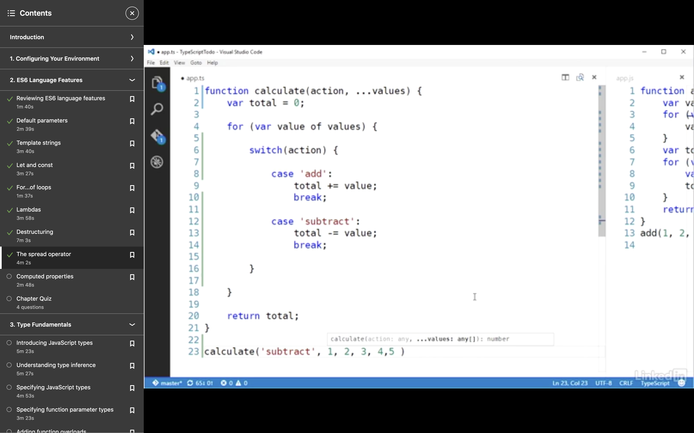
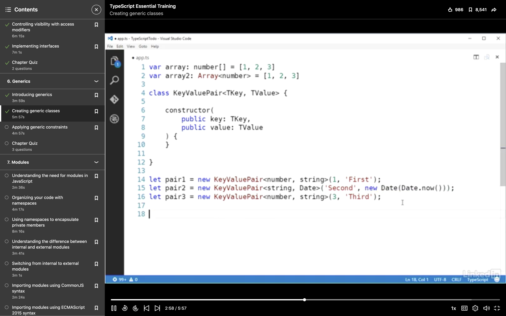
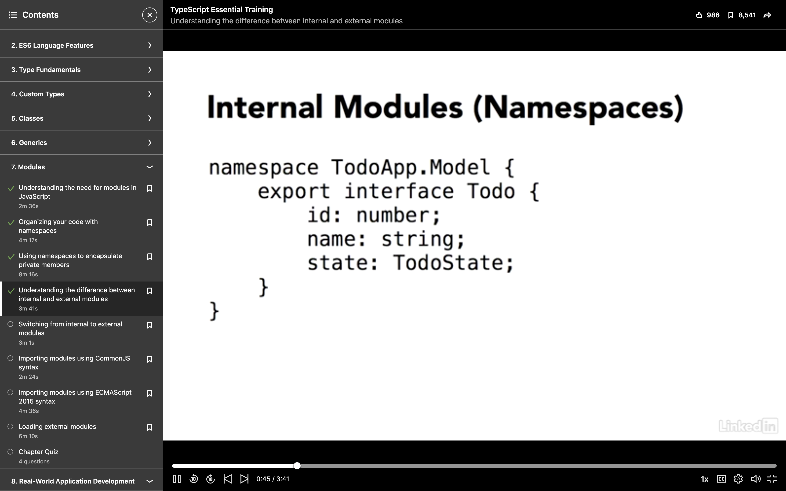

# TYPESCRIPT EXERCISE FROM LINKEDIN

## STEPS

* go to the desired directory-
```
vijayetar~/linkedInTutorials/TypeScript$
```

* check if npm is installed and if not then install it
``` 
npm -v
```

* install the typescript using npm
```
npm install -g typescript
```

* open program in visual studio code
```
code .
```

* set up tsconfig.json at the root of the folder
```
{
  "compilerOptions": {
    "target": "ES5",
    "outDir": "dist"
  }
}
```

* you will get an error.  create a new file model.ts at the root and the error should disappear with a new directory containing a copy of all the js files.

## TypeScript syntax

1. let and var are similar
2a. see how types are defined in the input and output for each line of code. the more explicit you are, the better it is. Examples of primitive types are:
```
number
string
boolean
Object
null
BigInt
Undefined
Symbol
```  
2b. You can use default parameters for overloading the constructor or functions:  
```
def countdown(initial, final=0, interval=1){
  // do countdown
}
```
2c. Template literals:
```
var displayStringLiteral: string = `here is the number ${todo.id} and call ${todo.name}, then complete the task ${todo.completed}`;
```

2d. Other syntax examples:

  

2e. Spread Operator   
3. __TypeInference__: allows Typescript to predict the output of a function and then create object with appropriate methods when assigned to the return value of the function.   
3a. __UnionTypes__: Here is example of union types using pipes
```
function totalLength(x: (string | any[]), y: (string | any[])): number {
    var total: number = x.length + y.length;
    
    x.slice(0)
    
    if(x instanceof Array) { // allows typeguard, and only for Objects
        x.push('TypeScript')
    } 
    
    if((parameter) x:string) { // this typeguard only works for primitive types
        x.substr(0)
    }
    
    return total;
}
```

4. __GradualTyping__: allows us to change the type using the type __any__ but it should be used sparingly.  
5. __Interfaces__: allow you to define the object better, and is compiled early  
  
* They also allow __duck typing__ so that even if the object is not defined again as the interface variable, as long as the obeject has the same properties as the interface object, typescript will equate the two... 
* Optional properties using "?":
```
interface Todo {
  name:string;
  completed?:boolean
}
```
* properties in interface:
```
interface ITodoService {
    add(todo: Todo): Todo;
    delete(todo: Todo): void;
    getAll(): Todo[];
    getById(todoId: number): Todo;
}
```

* Make properties and methods option, and use ES6
  
6. __enums__: powerful to restrict to two options and refer them later in both ts and js files
  

7. __union types and custom types__: check out the example to define a new type Cost that is string or number, as well as see how it is used.
  
8.  
 - if you convert the file to ts, then errors pop up.  first declare the properties, then add types to it. if a type does not exist then add an interface.   
 - for a class level property you have to create a static method or property within the class itself.
 - Here is the static file in TS  
     
 - Here is the static property in JS
   

9. Use of access modifiers also help clean up the JS code more without using dunders, but since TS only extends JS, JS code, despite warnings, will still function with wrong access modifiers.  So continue using dunder before private properties and methods.
  
10. Generics in Typescript  

  
11. Abstract classes in TS allows us to set up base classes with intention to never instantiate these classes:
```
abstract class TodoStateChanger {
    
    constructor(private newState: TodoState) {
    }
    
    abstract canChangeState(todo: Todo): boolean;
    
    changeState(todo: Todo): Todo {
        if(this.canChangeState(todo)) {
            todo.state = this.newState;
        }
        
        return todo;
    }
    
}
```
12. IFE to call function immediately as soon it is written

```
var jQuery = {
    version: 1.19,
    fn: {}
};

(function defineType($) {
    
    if( $.version < 1.15 )
        throw 'Plugin requires jQuery version 1.15+'
        
    $.fn.myPlugin = function() {
        // my plugin code
    }
    
    
})(jQuery)
```
13. Internal Modules help set up private and protected methods and variables in a much cleaner way.  This is still done but not as popular as exter modules.  

  

14a. To use external Modules first change the tsconfig.json file to add this :
```
{
    "compilerOptions": {
        "target": "es5",
        "module": "system"
    }
}
```
then import the required classes and functions in the necessary files:
```
import Model = require('./model');
import Todo = Model.Todo;
```
OR
```
import { Todo as TodoTask, TodoState } from './model';
import './jQuery'

let todo: TodoTask;
```
14b. System.js
In your index html replace the current script tags with the system.js package
```
    <script type="text/javascript" src="model.js"></script>
    <script type="text/javascript" src="TodoService.js"></script>
    <script type="text/javascript" src="app.js"></script>
```
with
```
    <script type="text/javascript" src="//cdnjs.cloudflare.com/ajax/libs/systemjs/0.19.22/system.js"></script>
    <script type="text/javascript">
        System.defaultJSExtensions = true;
        System.import('app')
    </script>
```
and in the corresponding js file where we need to import module:
```
import Model = require('./model');
import Todo = Model.Todo;
```


