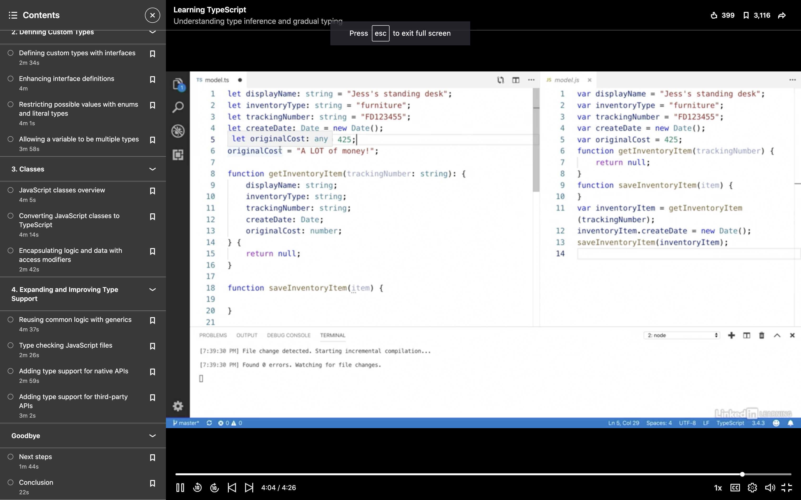
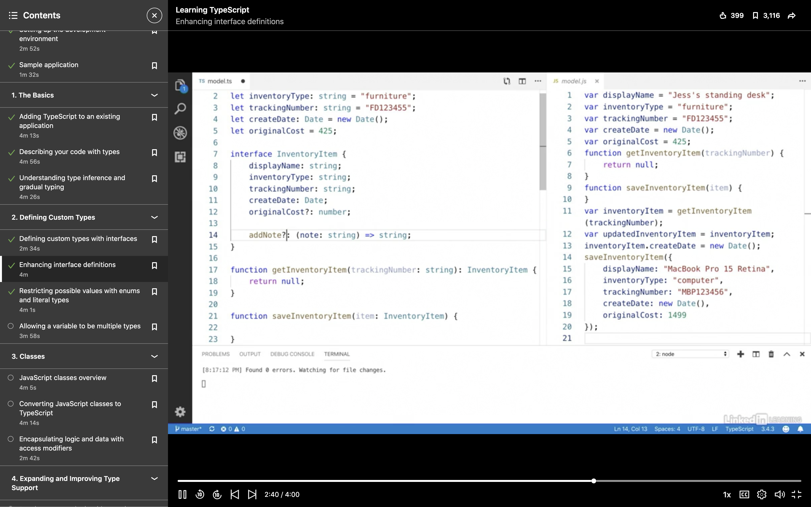
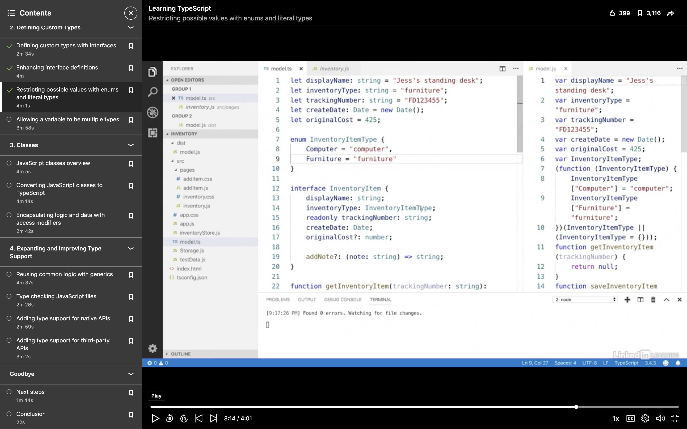
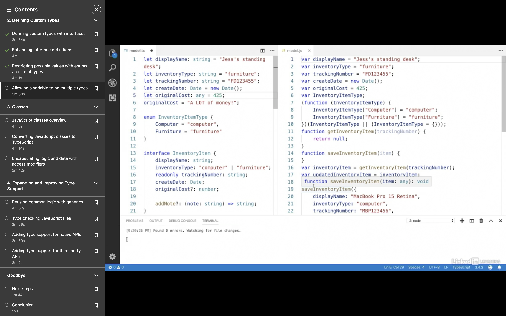
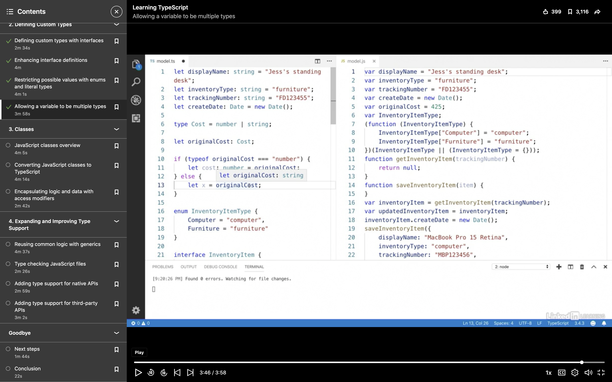
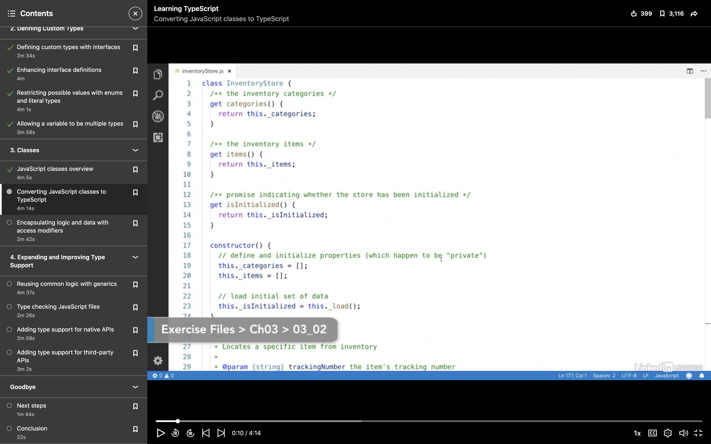
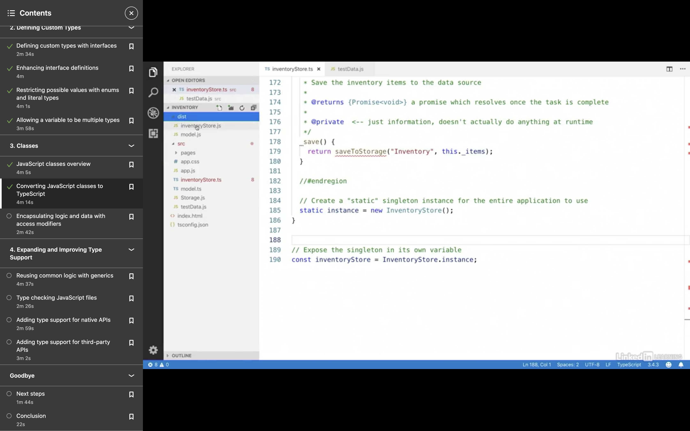
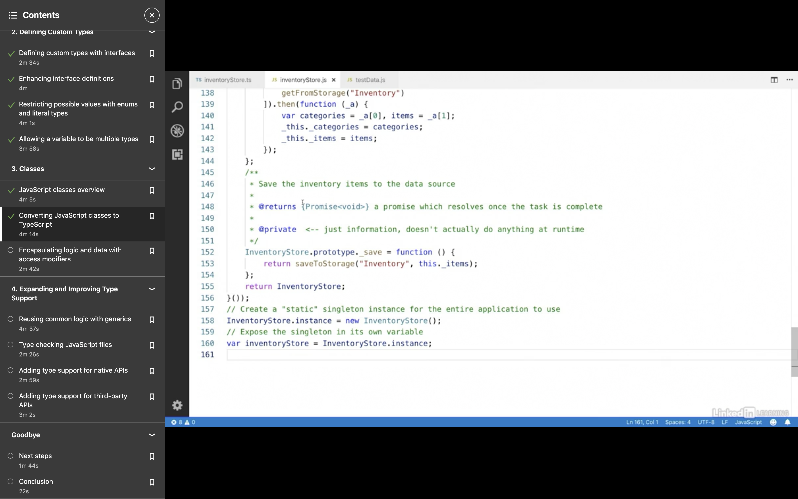
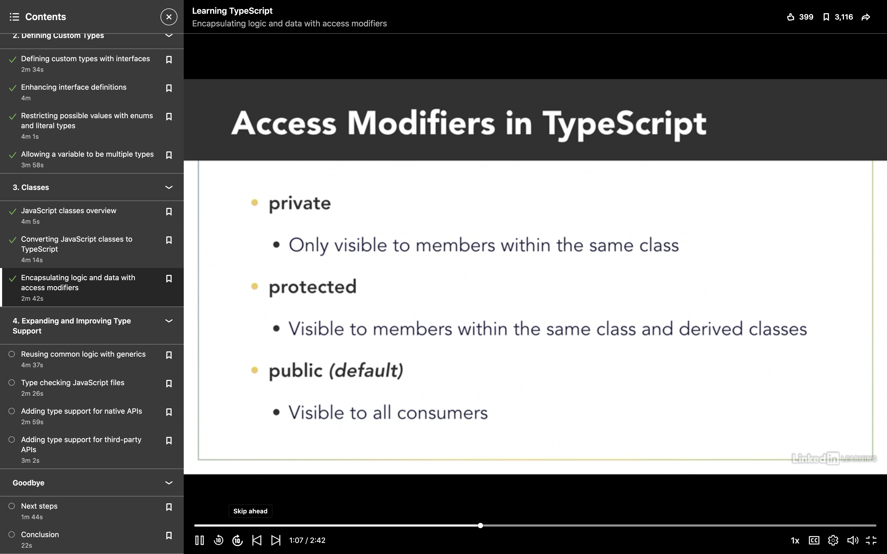
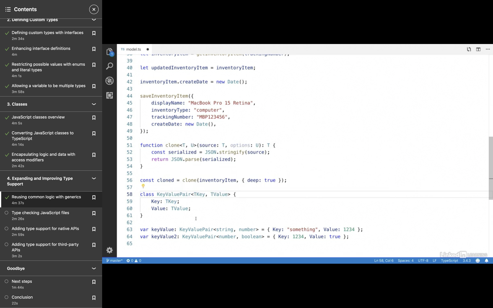

# TYPESCRIPT EXERCISE FROM LINKEDIN

## STEPS

* go to the desired directory-
```
vijayetar~/linkedInTutorials/TypeScript$
```

* check if npm is installed and if not then install it
``` 
npm -v
```

* install the typescript using npm
```
npm install -g typescript
```

* open program in visual studio code
```
code .
```

* set up tsconfig.json at the root of the folder
```
{
  "compilerOptions": {
    "target": "ES5",
    "outDir": "dist"
  }
}
```

* you will get an error.  create a new file model.ts at the root and the error should disappear with a new directory containing a copy of all the js files.

## TypeScript syntax

1. let and var are similar
2. see how types are defined in the input and output for each line of code. the more explicit you are, the better it is. Examples of primitive types are:
```
number
string
boolean
Object
null
BigInt
Undefined
Symbol
```  

  
3. __TypeInference__: allows Typescript to predict the output of a function and then create object with appropriate methods when assigned to the return value of the function.   
4. __GradualTyping__: allows us to change the type using the type __any__ but it should be used sparingly.  
5. __Interfaces__: allow you to define the object better, and is compiled early  
  
* They also allow __duck typing__ so that even if the object is not defined again as the interface variable, as long as the obeject has the same properties as the interface object, typescript will equate the two... 
* Make properties and methods option, and use ES6
  
6. __enums__: powerful to restrict to two options and refer them later in both ts and js files
  

7. __union types and custom types__: check out the example to define a new type Cost that is string or number, as well as see how it is used.
  
8.  
 - if you convert the file to ts, then errors pop up.  first declare the properties, then add types to it. if a type does not exist then add an interface.   
 - for a class level property you have to create a static method or property within the class itself.
 - Here is the static file in TS  
     
 - Here is the static property in JS
   

9. Use of access modifiers also help clean up the JS code more without using dunders, but since TS only extends JS, JS code, despite warnings, will still function with wrong access modifiers.  
  
10. Generics in Typescript  
  

